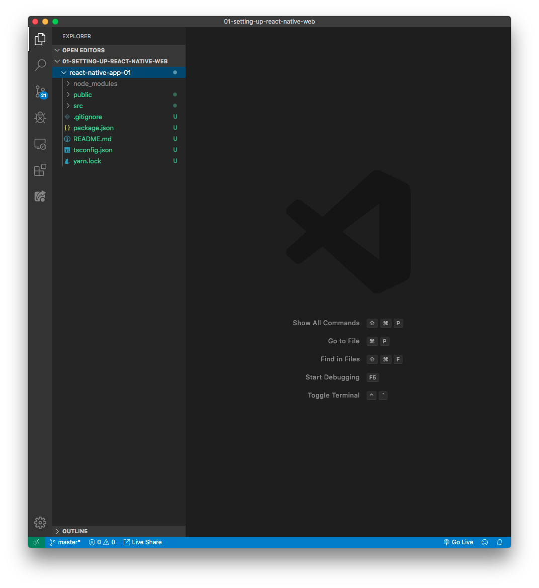

# React Native Web Series Practice

from youtube https://www.youtube.com/watch?v=J0b11tvEkFQ&list=PLN3n1USn4xll9wq0rw0ECrO0j2PFzuXtn

this example uses

- react native 0.60.0
- typescript
- TBA

## 01 

**initializing project**

```bash
yarn create react-app [project-name] --typescript
```

then the file directory looks like this:

